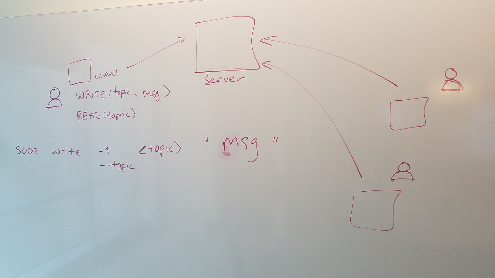

# CLI Message App (Toy Project)

## Purpose
- Learn the conceptual structure of existing coconut CLI tool.
- Learn more about the technologies used on the serverless team day-to-day.
- Practical application of Go language and other technologies

## Technologies
- Go
- Goland (IDE)
- gRPC (Google remote protocol controller)
- Protobuf

## User Stories

- As a user I want a clear easy to use command that starts the program.
- As a user I want to be able to write a command with a flag `-t` or `--topic` that adds a message to an existing set of messages on the server for that topic.
- As a user I want to be able to use a command with a given topic that returns all of the message content for a topic from the server.
- As a user I want to be able to have a command that allows me to quit the program (not in original scope)
- As a developer I want to make both the `topic` flag and message required in the command line interface.
- As a developer I want to make a good, clear error message for the command line interface if a user does not include both the `topic` flag and a message string (string cannot be empty/null) that prompts the user to re-enter the command or quit the program.
- As a developer I want to have a clear separation of concerns in the code for client vs. server.
- As a developer I want to have a clear separation of unit and integration tests for client and server code, as appropriate, that helps drive design of application and verifies it works and that error handling works correctly. 

## Wireframe Overview

## Install the application

## How to use the application

## Resources
- reminder on image sizing in readmes: https://www.xaprb.com/blog/how-to-style-images-with-markdown/